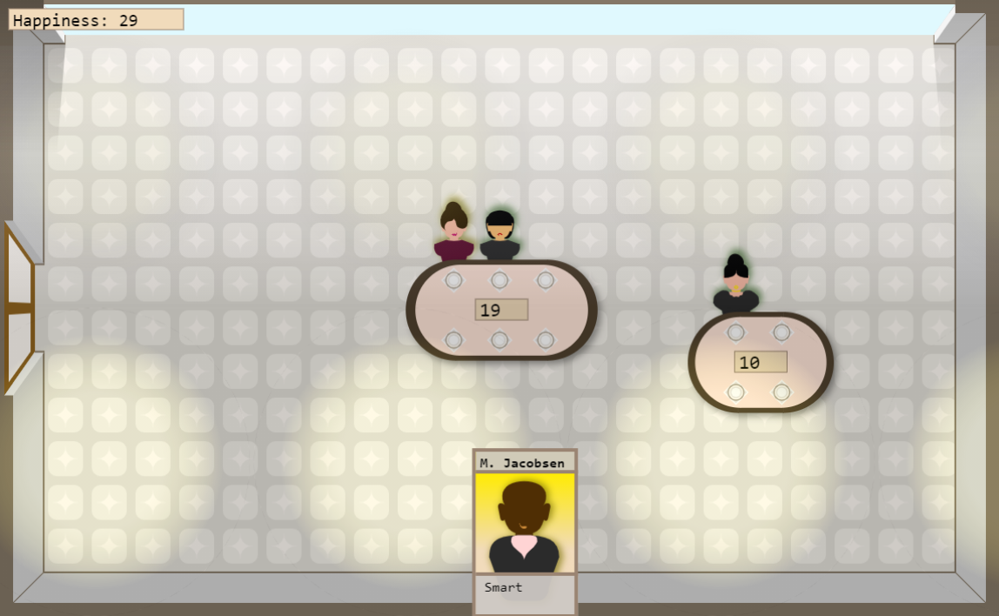

# Seating Space Planner
This is a game developed for [js13kgames 2021 competition](https://2021.js13kgames.com/) where the theme is "**Space**".

You can play a live version here: https://seating-space-planner.dosaki.net/

## About
You've planned your wedding reception seating but unpredicted guests keep arriving!

You must now plan their seating space on the fly.

Drag guest cards to the available tables, but pay attention to their traits and don't let them get too angry with each other.

Guests chat to each other but interactions may be negative or positive, use that as a clue to who doesn't fit in a table.

